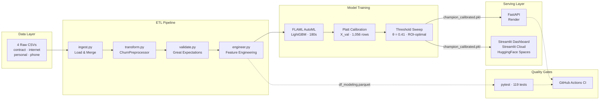

# Customer Churn Intelligence System

**Interconnect Telecom** — End-to-end ML pipeline for proactive churn prevention.

[](https://github.com/marianunez-data/customer-churn-prediction-telecom/actions/workflows/ci.yml)
[](https://github.com/marianunez-data/customer-churn-prediction-telecom)
[](https://github.com/marianunez-data/customer-churn-prediction-telecom)
[](https://churn-api-ynok.onrender.com/docs)
[](https://churn-intelligence.streamlit.app/)

---

## Architecture



---

## Live

|                     |                                                                           |
| ------------------- | ------------------------------------------------------------------------- |
| Streamlit Dashboard | https://churn-intelligence.streamlit.app/                                 |
| HuggingFace Space   | https://huggingface.co/spaces/marianunez-data/customer-churn-intelligence |
| FastAPI             | https://churn-api-ynok.onrender.com/docs                                  |

> **Note:** FastAPI runs on Render's free tier — first request may take ~30s due to cold start.

---

## Results

| Metric                | Value                                         |
| --------------------- | --------------------------------------------- |
| Test AUC              | **0.9078**                                    |
| CV AUC (5-fold)       | 0.9075 ± 0.0057                               |
| Precision @ θ=0.41    | **76.0%** — 3 in 4 contacts are real churners |
| Recall @ θ=0.41       | 69.5%                                         |
| Brier Score           | 0.1013 (calibrated)                           |
| Net ROI — test cohort | **+$1,617** vs −$12,903 do-nothing            |

---

## Tech Stack

|                        |                                                                                                                                                         |
| ---------------------- | ------------------------------------------------------------------------------------------------------------------------------------------------------- |
| **ML**                 | LightGBM · XGBoost · scikit-learn · FLAML AutoML · SHAP (waterfall / beeswarm / dependence) · Platt Calibration · StratifiedKFold · OOF threshold sweep |
| **Data & ETL**         | pandas · NumPy · sklearn Pipeline · ColumnTransformer · OrdinalEncoder · Great Expectations · ETL pipeline                                              |
| **API**                | FastAPI · Pydantic v2 · Uvicorn · Render                                                                                                                |
| **Dashboard**          | Streamlit · Plotly · Matplotlib · Streamlit Cloud · HuggingFace Spaces                                                                                  |
| **Containers**         | Docker · Docker Compose                                                                                                                                 |
| **Tracking & Testing** | MLflow · pytest (119 tests) · Git · GitHub Actions CI                                                                                                   |

---

## Project Structure

```
customer-churn-prediction-telecom/
├── .github/workflows/
│   └── ci.yml                    # GitHub Actions — pytest on push/PR
├── app/                          # Streamlit dashboard
│   ├── dashboard.py              # Home — KPIs, pipeline integrity
│   └── pages/
│       ├── 1_Model_Audit.py      # Model card, calibration, SHAP plots
│       ├── 2_ROI_Simulator.py    # Threshold / cost / capacity sliders
│       └── 3_Live_Scoring.py     # Customer search + manual profile builder
├── src/
│   ├── etl/
│   │   ├── ingest.py             # Load & merge 4 raw CSVs
│   │   ├── transform.py          # ChurnPreprocessor (sklearn-compatible)
│   │   └── validate.py           # Great Expectations validation gates
│   ├── features/
│   │   └── engineer.py           # Tenure, churn target, segment
│   ├── models/
│   │   ├── train.py              # FLAML AutoML retraining script
│   │   └── predict.py            # load_champion · score_customer · score_batch
│   └── api/
│       └── main.py               # FastAPI — 5 endpoints
├── models/
│   └── champion_calibrated.pkl   # Pipeline + Platt calibrator (deployed)
├── reports/                      # Metrics, SHAP plots, GE validation reports
├── data/processed/               # df_clean.parquet · df_modeling.parquet
├── tests/                        # 119 tests — pytest + Great Expectations
├── notebook/
│   └── customer_churn_analysis.ipynb
├── Dockerfile                    # FastAPI production image
├── Dockerfile.streamlit          # Streamlit production image
├── docker-compose.yml            # Orchestrates API + Dashboard locally
├── requirements.txt              # All dependencies (single source of truth)
└── pytest.ini
```

---

## Pipeline

```
Raw CSVs (4 files)
    ↓  load_raw_data()
    ↓  ChurnPreprocessor.fit_transform()
    ↓  engineer_features()
    ↓  stratified split  75 / 15 / 10
         │
         ├─ FLAML AutoML 180s                ← X_train fit · X_val eval
         ├─ Pipeline.fit(X_train)            ← 5,282 rows · zero leakage
         ├─ Platt calibration (X_val)        ← unseen by champion
         ├─ OOF threshold sweep              ← θ_optimal = 0.41
         └─ Honest test evaluation           ← X_test first & only use
                  AUC 0.9078 · ROI +$1,617
```

---

## Quick Start

```bash
git clone https://github.com/marianunez-data/customer-churn-prediction-telecom.git
cd customer-churn-prediction-telecom
python3 -m venv .venv && source .venv/bin/activate
pip install -r requirements.txt
```

```bash
streamlit run app/dashboard.py        # Dashboard → http://localhost:8501
uvicorn src.api.main:app --reload     # API       → http://localhost:8000/docs
pytest tests/ -q                      # 119 passed
```

### Local — Docker

```bash
docker-compose up --build
# Dashboard → http://localhost:8501
# API       → http://localhost:8000/docs
```

---

## API

Base URL: `https://churn-api-ynok.onrender.com`

| Method | Endpoint              | Description                           |
| ------ | --------------------- | ------------------------------------- |
| GET    | `/health`             | Model status + threshold              |
| GET    | `/model/info`         | AUC, params, ROI metadata             |
| POST   | `/predict`            | Single customer score + optional SHAP |
| POST   | `/predict/batch`      | Up to 500 customers, ranked by risk   |
| GET    | `/customers/top-risk` | Top-N from precomputed test set       |

**Example — single prediction:**
```bash
curl -X POST https://churn-api-ynok.onrender.com/predict \
  -H "Content-Type: application/json" \
  -d '{
    "type": "Month-to-month",
    "paperless_billing": "Yes",
    "payment_method": "Electronic check",
    "gender": "Female",
    "senior_citizen": 0,
    "partner": "No",
    "dependents": "No",
    "internet_service": "Fiber optic",
    "online_security": "No",
    "online_backup": "No",
    "device_protection": "No",
    "tech_support": "No",
    "streaming_tv": "Yes",
    "streaming_movies": "Yes",
    "multiple_lines": "No",
    "monthly_charges": 85.5,
    "total_charges": 2100.0,
    "tenure_days": 180
  }'
```

```json
{
  "p_churn": 0.7821,
  "flagged": true,
  "risk_tier": "High",
  "threshold": 0.41,
  "top_drivers": [],
  "latency_ms": 12.4
}
```

---

## Model

|             |                                     |
| ----------- | ----------------------------------- |
| Algorithm   | LightGBMClassifier                  |
| Tuning      | FLAML AutoML · 180s · seed=42       |
| Calibration | Platt Scaling on X_val (1,056 rows) |
| Imbalance   | is_unbalance=True                   |
| Features    | 18 — 15 categorical + 3 numeric     |
| θ_optimal   | 0.41 — OOF sweep, capacity ≤ 25%    |
| Vc / Cr     | $69 / $20 — dataset-grounded        |

**Top SHAP drivers:**

| Feature         | Mean \|SHAP\| | Insight                       |
| --------------- | ------------- | ----------------------------- |
| tenure_days     | 1.73          | New customers churn most      |
| type (contract) | 0.89          | Month-to-month → highest risk |
| total_charges   | 0.48          | Low spend → higher risk       |
| monthly_charges | 0.38          | Service tier proxy            |
| online_security | 0.28          | No security → higher risk     |

---

## Trade-offs & Design Decisions

| Decision | What I chose | Why | What I'd change at scale |
| --- | --- | --- | --- |
| **AutoML vs manual tuning** | FLAML 180s budget | Reproducible search over LightGBM + XGBoost in one run; beats hand-tuned baselines by +0.02 AUC | Longer budget (600s+), add CatBoost to search space, Optuna with Bayesian TPE |
| **Threshold selection** | OOF sweep on validation set, θ=0.41 | Avoids test leakage; capacity constraint ≤25% keeps outreach feasible | A/B test multiple thresholds in production with real retention outcomes |
| **Calibration method** | Platt Scaling on X_val (1,056 rows) | Simple, effective for binary classification; Brier 0.1013 confirms reliability | Isotonic regression if dataset grows beyond 10k; recalibrate monthly |
| **Single model vs ensemble** | Single LightGBM pipeline | Simpler deployment, faster inference (~12ms), easier to explain with SHAP | Stacked ensemble (LightGBM + XGBoost + logistic) behind a meta-learner |
| **ROI framework** | Vc=$69, Cr=$20 from dataset statistics | Grounds business value in data, not assumptions; enables threshold optimization | Partner with finance for real retention program costs and CLV model |
| **Free tier hosting** | Render (API) + Streamlit Cloud (Dashboard) | Zero-cost deployment for portfolio; demonstrates full serving layer | Migrate to AWS (ECS/Lambda) with auto-scaling, or GCP Cloud Run |
| **SHAP on-demand** | Computed per-request via `include_shap=True` | Avoids latency penalty for bulk scoring; only computes when needed | Precompute SHAP for batch jobs, cache results in Redis |
| **No feature store** | Features computed at inference time | Acceptable for 18 features and single-model serving | Feast or Tecton for feature consistency across training and serving |

### Known Limitations

- **Cold start:** Render free tier spins down after 15 min of inactivity — first request takes ~30-45s. Not a limitation of the model or code.
- **No drift detection:** The model assumes the input distribution matches training data. In production, I'd add Evidently AI to flag feature drift before predictions degrade.
- **No A/B testing infrastructure:** The optimal threshold (θ=0.41) was selected offline. Real deployment would require online experimentation to validate retention impact.
- **Single-region deployment:** API runs in one Render region. For a global telecom, I'd deploy multi-region with a load balancer.

---

## Observability

The API logs every prediction with structured fields — no external tools required to audit model behavior.

**Log format** (from `src/api/main.py`):

```
2025-03-15 14:32:01 | INFO | predict | id=C-1042 p=0.782 tier=High latency=12.1ms
2025-03-15 14:32:05 | INFO | batch   | n=50 flagged=12 latency=85.3ms
2025-03-15 14:33:12 | WARNING | SHAP computation failed: feature mismatch
```

**What's tracked per request:**

| Field | Source | Purpose |
| --- | --- | --- |
| `latency_ms` | `time.perf_counter()` | Inference speed monitoring |
| `p_churn` | Platt-calibrated output | Probability audit trail |
| `risk_tier` | Threshold-based bucketing | Business-layer tracking |
| `customer_id` | Optional query param | Request traceability |
| `flagged` | `p >= θ_opt` | Decision audit |

**Latency benchmarks** (warm state, single customer):

| Operation | p50 | p95 |
| --- | --- | --- |
| Predict (no SHAP) | ~12ms | ~25ms |
| Predict (with SHAP) | ~80ms | ~150ms |
| Batch 100 (no SHAP) | ~120ms | ~200ms |

**Next steps for production monitoring:** Evidently AI for data drift reports, Prometheus + Grafana for latency dashboards, alerting on prediction distribution shifts.

---

## Tests

```
test_api.py            37 tests   FastAPI endpoints
test_predict.py        35 tests   load_champion, score_customer, score_batch
test_transform.py      25 tests   ETL, feature engineering, leakage prevention
test_clean_data.py      4 tests   Great Expectations — df_clean.parquet
test_modeling_data.py   6 tests   Great Expectations — df_modeling.parquet
─────────────────────────────────
                      119 passed
```

---

## Retrain

To update the model with new customer data, place updated CSVs in `data/raw/` then:

```bash
python -m src.models.train                 # FLAML AutoML
python -m src.models.train --no-automl    # use stored best params
python -m src.models.train --budget 300   # longer search
```

---

## Author

**Maria Camila Gonzalez Nuñez** · Data Scientist
[GitHub](https://github.com/marianunez-data)
